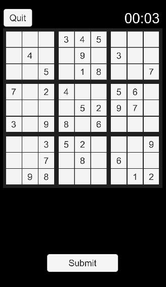

<!-- Centered Title and Image -->

  <h1>Sudoku Challenge</h1>
  

## Game Description

**Sudoku Challenge** is a fun and engaging Sudoku puzzle game for Android, featuring dynamic board generation, multiple difficulty levels, pencil mode, error highlighting, and a modern, user-friendly interface.

## Features

- Dynamic Sudoku board generation
- Multiple difficulty levels
- Pencil mode for candidate notes
- Error highlighting for incorrect entries
- Hint system to help when you’re stuck
- Clean, modern UI with interactive feedback

## How to Play / Installation

1. Download the latest `Sudoku.apk` from the [Releases page](https://github.com/michelbr84/SudokuChallenge/releases).
2. Install the APK on your Android device.
3. Launch the game, select your desired difficulty, and start solving!
4. Use Pencil mode to jot down possible numbers in each cell.
5. Press the Submit button to check your solution—incorrect numbers will be highlighted.
6. Use hints if you get stuck, but try to solve the puzzle on your own for the best challenge!

## Credits

- Developed by Michel Duek
- Special thanks to all playtesters and contributors!

## License

This project is licensed under the MIT License. See the [LICENSE](LICENSE) file for details.